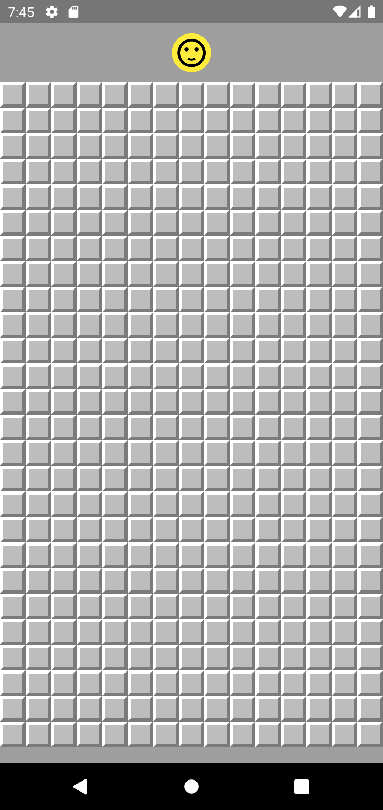
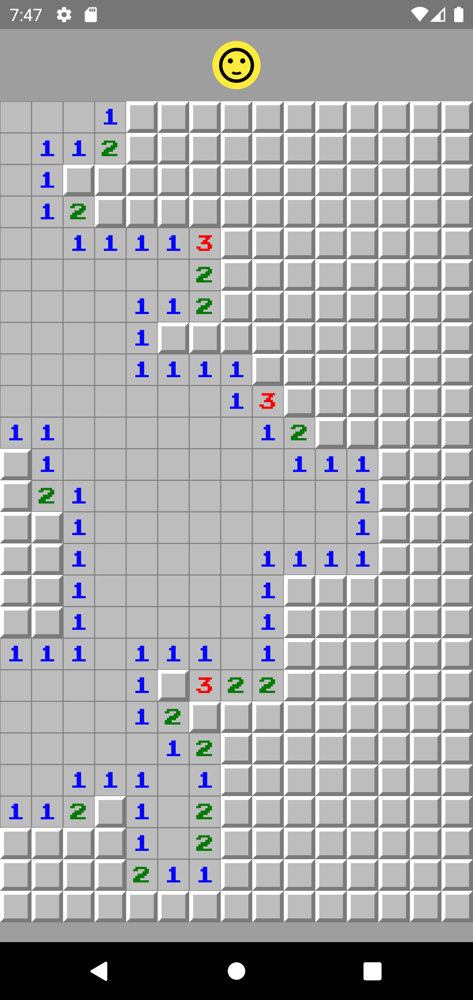
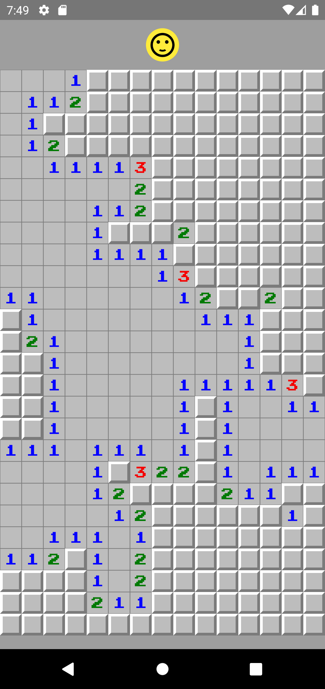

# Aplicativo Campo Minado

Este é um aplicativo Campo Minado construído usando Flutter. O aplicativo permite que os usuários joguem o jogo clássico Campo Minado em seus dispositivos móveis enquanto praticam suas habilidades de desenvolvimento de aplicativos móveis.

### Recursos

- Interface simples e fácil de usar
- Controles intuitivos e gráficos atraentes
- Jogabilidade clássica do Campo Minado
- Prática de habilidades de desenvolvimento de aplicativos móveis

### Capturas de Tela

Aqui estão algumas capturas de tela do aplicativo Campo Minado em ação:

    
    
    

### Começando

Para executar o aplicativo em sua máquina local, siga estas etapas:

1. Clone o repositório em sua máquina local
2. Abra o projeto em seu editor de código preferido
3. Execute flutter pub get para instalar as dependências necessárias
4. Conecte seu dispositivo móvel ao computador ou inicie um emulador
5. Execute flutter run para iniciar o aplicativo

### Tecnologias Usadas

Flutter

Dart

### Contribuindo

Contribuições para este projeto são bem-vindas. Se você encontrar algum problema ou quiser sugerir novos recursos, abra um novo problema ou pull request. Antes de enviar um pull request, certifique-se de que todos os testes estejam passando e que o código siga o guia de estilo do projeto.

### Licença

Este projeto está licenciado sob a Licença MIT. Consulte o arquivo LICENSE para obter detalhes.
